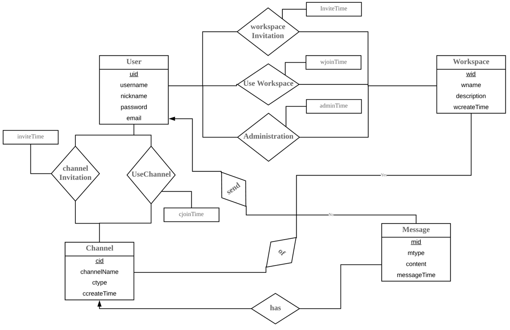
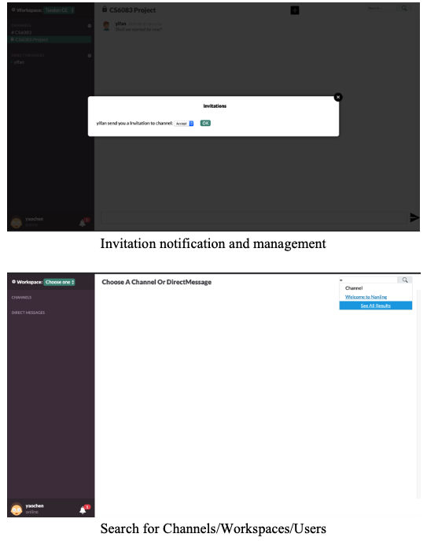

# slack-clone
A slack-clone Web application based on PHP and MySQL Database.

## Design of Database
### E-R Diagram


### Assumptions
1. In the User relation, we have assigned a global unique uid as a primary key, and also store the email address, password, username and nickname when a user has completed the register.
2. In the Workspace relation, we have also assigned a global unique wid as a primary key, and also store the name, descriptions of the workspace, the wcreatorId denotes the creator’s uid, and wcreateTime is the time when the given workspace is created.
3. In the Channel relation, we have also assigned a global unique cid as a primary key, and also store the wid of the workspace which the channel belong to, the channel’s name, its type (namely, public, private or direct), and it’s create time as ccreateTime.
4. In the Message relation, we have also assigned a global unique cid as a primary key, and also store the cid of the channel which the message belong to, mtype denotes it’s type (ranging from plain text, image, hyperlink etc.), the fromId denotes the sender’s uid. Moreover, the content and the time when the message was sent is also stored in the relation.
5. In the WorkspaceInvitation relation, we use the inviter’s id, invitee’s id and the workspace’s id as a combination primary key, and also store the time when the invitation is firstly sent. We decide not to combine the timestamp in order to avoid same invitations, which is considered as harassment invitation.

6. In the UseWorkspace relation, we combine the wid and uid as a primary key, and also store the join time of a given user. The reason we have this relation is that we may have n-to-n relation of users and workspaces. In addition, the record of the creator of a given workspace will be inserted into this relation when they create the workspace.
7. In the UseChannel relation, we combine the cid and uid as a primary key, and also store the join time of a given user. The reason we have this relation is that we may have n-to-n relation of users and channels.

8. In the Administration relation, we combine the workspace’s id and the administrator’s id as a primary key, we also store the time when a user is assigned the administration. Also, the record of creator of a given workspace will be inserted into this relation when they create the workspace. In addition, only the creator can promote others to be administrator. 

9. In the ChannelInvitation relation, we use the inviter’s id, invitee’s id and the channel’s id as a combination primary key, and also store the time when the invitation is firstly sent. For the reason (the same as in the WorkspaceInvitation) of avoiding harassment, we decide not to combine the time into the primary key.

## Relational Database System
### Relational Schema

```
User (uid, email, password, username, nickname);
Workspace (wid, wname, description, wcreatorId, wcreateTime);
Channel (cid, wid, channelName, ctype, ccreateTime);
Message (mid, cid, mtype, fromId, content, messageTime);
UseWorkspace (wid, uid, wjointime);
UseChannel (cid, uid, cjointime);
Administration (wid, uid, admintime);
Invitation (fromId, toId, type, id, inviteTime);
```

### Key Constraints
1. Primary Keys are all underlined.
2. Foreign Key Constraints:
Workspace.wcreatorId is referencing User.uid;
Channel.wid is referencing Workspace.wid;
Channel.ccreatorId is referencing User.uid;
Message.cid is referencing Channel.cid;
Message.fromId is referencing User.uid;
UseWorkspace.uid is referencing User.uid;
UseWorkspace.wid is referencing Workspace.wid;
UseChannel.uid is referencing User.uid;
UseChannel.cid is referencing Channel.cid;
Administration.wid is referencing Workspace.wid;
Administration.uid is referencing User.uid;
Invitation.fromId is referencing User.uid;
Invitation.toId is referencing User.uid.


## Description and Justification
In our design of the database system, the unregistered user will have to firstly create an account to the system and then log in the slack system. Then the user can create or join workspaces and communicate with others inside the channels. 

The left column should be a list of workspaces that the user has joined, and clicking the workspace button will display the channels inside the workspace that is accessible to this user. 

The middle part should be like a chatroom. The user can see the channel’s name and all the messages in the channel in chronological order.

The right column should be a list of the user’s friends(users that have a direct channel), and the search bar should also be placed at the top part of this column. The search button is used to find other workspaces and public channels, and the add button is used to add friends.

The prototype of the final web application is like the picture shows below:


## Design 
### Overview
In order to design the web-based user interface of slack-liked workspace, channel and message system, we implement the web application with the PHP, Javascript and MySQL Database as back-end technologies and HTML and CSS as front-end. In order to reduce the redundant code and functions in the project, we widely utilize the jQuery library and HTTP GET/POST methods. When it comes to re-directing and reloading several parts of the web application, hyperlink and self-defined JavaScript functions are intensively utilized. To improve the usability of the user interface, main HTML components such as button and selector, CSS features such as background highlight and even jQuery Modal styled toggled message are also implemented. In addition, some AJAX technologies and specific handlers  and dynamic data transmission via JSON parsing are also involved in this web application.

To enhance the security of our project, we have implemented sanitization of user input via PHP’s built-in functions to avoid the injection attack and some session hijacking instances.

### Register/Login Page
When a current or new user is trying to use the web application, they will be firstly directed to the login/register index. When it comes to the register page, the input messages such as username, email will be firstly send to the database to determine whether duplicate content exists, then in the login page, the logged user’s username and password will be checked in the database as well to ensure the existence.

Below are the snapshots of the login and register page:


### Slack Systems Page
After the successful login/register, the user will be redirected to the slack system. The username will be stored as a session. In the system, a user can freely select the workspaces and channels he/she belongs to, to the left of the workspace selector, an add button denotes the creation of new workspaces with jQuery modal message library. Below the workspace selector is the channel list, which will list all the channels the current user has joined. To the right of the channel list is an add button to create new Channels. Then below the channel list is the direct message list which list all the direct message between current user and others. Similarly, the add button attached is for creating new direct message.


In the main message container, the channel name or another user’s name will be shown. To the right of the title is the add button for sending invitations to other users to join in a workspace, channel or giving privilege of administration to workspaces. Then located in the right top corner is the search system of the web application. All Workspace the user has joined, public Channels and direct messages can be searched and located in the result of the search system. On the left bottom corner of the slack page is current user’s avatar picture, clicking it will lead to automatic log-out of the current user. Then the bell picture with dotted numbers denotes the unread notifications of current user which contains invitations from other users.



